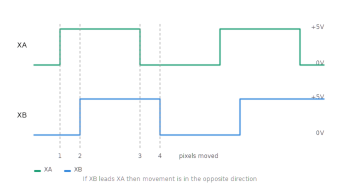

# RetroLink

RetroLink is a small **USB input adapter for retro computers**.

It allows modern **USB mice and USB joysticks** to be used on classic systems such as:

- Atari ST
- Commodore Amiga
- Commodore 64

The device translates USB input into the signals expected by the original hardware.  
The goal of this project was to create a **simple, flexible and hackable adapter** that hobbyists can build themselves.

This project started mostly as a fun experiment — and like many hobby projects it slowly grew into something more useful.

---

# Features

- USB mouse support
- USB joystick support
- Works with **Atari ST**, **Amiga**, and **C64**
- Configurable **mouse speed**
- Switch between **ST mouse** and **Amiga mouse**
- **Swap mouse buttons**
- Configurable **autofire frequency**
- **Joystick learning wizard** for mapping any USB controller
- Configuration stored in flash memory
- Simple **terminal based configuration interface**

---

# Why This Project Exists

Many classic computers such as the Atari ST, Amiga and Commodore 64 use the well known **DB9 joystick and mouse connectors**.  
Unfortunately, the original peripherals that used these connectors are becoming harder to find and often suffer from age-related problems.

One very common issue is **cable breakage**. After decades of use the cables inside original mice and joysticks tend to become brittle and eventually fail. Repairing them is sometimes possible, but often not worth the effort.

Another problem is that many of the original joysticks simply **aren't very comfortable by modern standards**. Modern USB controllers are usually much more ergonomic and precise.

RetroLink started as a small experiment to solve these problems.

The original goal was simply to make it possible to use **modern USB mice and controllers** on classic machines without modifying the computer itself.

During development a few additional ideas were added:

- A **controller learning wizard** so that almost any USB HID joystick can be mapped automatically.
- Adjustable **mouse speed**, since USB mice can behave very differently from the original hardware.
- A configurable **autofire function**, which can be very useful for certain games.
- The ability to switch between **Atari ST and Amiga mouse modes**.

What started as a small weekend experiment slowly grew into a more complete adapter that turned out to be quite useful in everyday retro computing.

RetroLink is still very much a **hobby project**, and the design intentionally remains simple so that other people can build, modify, and improve it.

---

# How RetroLink Works

RetroLink acts as a small translation layer between modern USB devices and the electrical interface expected by classic computers.

At one side a **USB mouse or joystick** is connected.  
On the other side the adapter generates the signals that the retro computer expects on its **DB9 port**.

Internally the firmware reads USB HID reports and converts them into:

- **quadrature signals** for mouse movement
- simple **switch-based joystick signals** (one line per button)
- optional **autofire pulses**

The configuration of the device can be changed through a **serial terminal interface**.

---

## Microcontroller: CH559L

The heart of the system is the **CH559L** microcontroller.

This chip was selected mainly because it integrates a surprising amount of functionality in a very small and inexpensive package:

One particularly useful property is that the **CH559 can run directly from a 5 V supply**.  
This makes it very convenient for retro hardware projects where 5 V is usually the only available voltage.

Other reasons to select this MCU:
- It has a USB **Host** and device controller
- It has internal Flash memory that has a reserved area for data storage
- It has a internal 3.3 V regulator which even has an output that you can use for light tasks as e.g. pullup resistors
- It offers firmware flashing through a USB-A to USB-A cable.


### Limitations of the CH559

The CH559 is a very capable chip, but it also has a few limitations.

The most important one is the **very limited RAM size**.

This means RAM must be used carefully.  
For example, almost all constant text used by the console interface is stored in **Flash memory** instead of RAM.

In the firmware this is done using the `__code` memory qualifier:

```
static const char __code title1[] = "RetroLink v1.02";
```

Strings stored this way remain in Flash and do not consume valuable RAM.

This is a common technique when writing firmware for small 8051-based systems.

---

## USB Host Operation

The CH559 contains a built-in **USB host controller**, which is used to communicate with the connected USB device.

RetroLink supports devices that implement the **USB HID class**, such as:

- HID mice
- HID joysticks
- HID gamepads

The firmware periodically polls the USB device and reads the **HID reports**.

These reports contain information such as:
- mouse movement
- button states
- joystick axis positions

The firmware then interprets this data and converts it to signals suitable for the target system.

---

## Mouse Emulation

Classic mice for systems like the Atari ST and Amiga use **quadrature encoding**.
Instead of sending absolute movement values, the mouse generates two signals per axis:



```
X1 / X2
Y1 / Y2
```

These signals form a quadrature pair which indicates both **direction** and **movement speed**.
RetroLink converts USB mouse movement into this quadrature pattern in software.
The firmware uses a timer interrupt to generate the correct sequence of pulses at the required rate.

---

## Joystick Mapping

USB controllers can use many different HID report layouts.

To handle this variability RetroLink includes a **learning wizard**.

During the learning process the firmware:

1. Records the idle report values
2. Detects which byte changes when a control is moved
3. Stores the offset and threshold used for that control

This allows almost any HID joystick to be mapped automatically.

The resulting configuration is stored in flash memory so it persists after power cycling.

---

## Open Collector Outputs

Classic joystick interfaces use **open collector signalling**.

This means the device should only **connect a line to ground**, while the host system provides the pull-up resistor.

Driving the line high directly could cause conflicts or even damage hardware.

The CH559 includes a special port configuration register that allows pins to operate in **open-drain / open-collector mode**.

RetroLink uses this feature so the signals behave much more like the original hardware.

This improves compatibility with vintage machines.

---

## Serial Configuration Interface

RetroLink includes a **serial console interface** used for configuration.

This is implemented with a **CH340N USB-to-serial converter**.

Through this interface users can:

- change mouse speed
- switch between ST and Amiga mouse modes
- swap mouse buttons
- configure autofire frequency
- run the joystick learning wizard

The CH340N was chosen mainly because it is:

- inexpensive
- widely available
- supported by drivers on most operating systems

However, it is not strictly required.  
The firmware simply exposes a standard UART interface, so an external **USB-to-serial adapter** could also have been used.

---

## Power Protection

The design includes an **LM66100 ideal diode controller**.

This component prevents **reverse current flow** between the USB side and the retro computer.

Some retro systems provide power on their joystick port, and without protection this could accidentally feed power back into the USB connection.

The LM66100 ensures that power only flows in the correct direction.

---

## A Few Fun Details

A few small details that might be interesting:

- The entire firmware runs on a classic **8051 architecture**, which is quite different from modern ARM-based microcontrollers.
- The learning wizard dynamically determines the **HID report layout**, so the firmware does not need predefined controller profiles.
- The CH559 allows pins to be reconfigured very flexibly, which makes it well suited for experimenting with different retro interfaces.

RetroLink is intentionally kept relatively simple so that the hardware and firmware remain **easy to understand and modify**.

# Hardware

Information about building the hardware can be found here:

```
/hardware/README.md
```

You can order a **almost fully assembled board from JLCPCB**

---

# Connecting RetroLink

1. Connect the **RetroLink adapter** to your computer's joystick/mouse port.
2. Connect a **USB mouse or joystick** to the USB-A port.
3. Connect the **USB debug port** to your PC if you want to configure the device.

Configuration is done through a **serial terminal**.

---

# Opening the configuration console

RetroLink provides a **serial terminal interface** for configuration.

Connect the device to your PC and open a serial terminal.

Common tools:

- PuTTY
- TeraTerm
- minicom
- Arduino Serial Monitor

Typical settings:

```
2000000 baud
8 data bits
no parity
1 stop bit
```

After connecting you should see something like:

```
RetroLink v1.02
USB Input Adapter
ST / Amiga / C64
github.com/Fbeen/RetroLink
```

---

# Main Menu

The console shows the following menu:

```
1. Set Mouse Speed
2. Emulate ST or Amiga mouse
3. Swap Mouse Buttons
4. Learn Controller
5. Autofire Frequency
```

Simply press the number of the option you want to change.

---

# Setting the Mouse Speed

The mouse speed can be adjusted to match your personal preference.

Available settings:

```
1 - Very Slow
2 - Slow
3 - Normal
4 - Fast
5 - Turbo
```

The selected value is stored in the device configuration.

---

# Switching between Atari ST and Amiga mouse

RetroLink can emulate both mouse protocols.

Menu option:

```
2. Emulate ST or Amiga mouse
```

Each time you select it, the mode toggles between:

- Atari ST mouse
- Amiga mouse

---

# Swapping Mouse Buttons

Some users prefer the mouse buttons reversed.

Menu option:

```
3. Swap Mouse Buttons
```

This toggles between:

- normal button layout
- swapped buttons

---

# Configuring a USB Joystick

USB controllers often use different report formats.  
To support almost any controller, RetroLink includes a **learning wizard**.

Select:

```
4. Learn Controller
```

The wizard will guide you through the setup.

Example flow:

```
Controller Learning Wizard
--------------------------------

Release joystick and scanning...

Push UP
Push DOWN
Push LEFT
Push RIGHT
Press FIRE
Press AUTOFIRE
```

Follow the instructions and move the joystick as requested.

After the last step the configuration will be saved automatically.

---

# Autofire Frequency

RetroLink can generate autofire signals for the joystick.

Menu option:

```
5. Autofire Frequency
```

Available options:

```
1 - Autofire 8 Hz
2 - Autofire 9 Hz
3 - Autofire 10 Hz
4 - Autofire 11 Hz
5 - Autofire 12 Hz
```

Choose the speed that feels best for the game you are playing.

---

# Firmware

Firmware can be compiled and flashed using the scripts in:

```
/scripts
```

More information can be found here:

```
/hardware/README.md
```

---

# Repository

Project repository: https://github.com/Fbeen/RetroLink

---

# Final notes

This is a **hobby project** built for fun and experimentation with retro hardware.

Feel free to:

- build your own
- modify the hardware
- improve the firmware
- or use the code in your own projects

Contributions and ideas are always welcome.

---

## Disclaimer

This project is provided **as-is**, without any warranty.

Use this hardware and firmware **entirely at your own risk**.  
The author cannot be held responsible for **any damage to hardware, software, data, or other equipment** resulting from the use or misuse of this project.

Building and using the RetroLink adapter is a **DIY hobby activity**, and you are responsible for ensuring it is used safely with your own equipment.