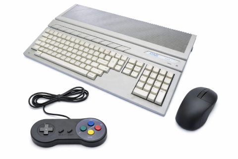
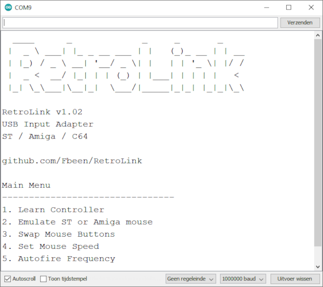

# RetroLink



RetroLink is a small **USB input adapter for retro computers**.

It allows modern **USB mice and USB joysticks** to be used on classic systems such as:

- Atari ST
- Commodore Amiga
- Commodore 64

---

## ? Table of Contents

- [Features](#features)
- [Button Control & LED Feedback](#button-control--led-feedback)
- [Why This Project Exists](#why-this-project-exists)
- [How RetroLink Works](#how-retrolink-works)
  - [Microcontroller](#microcontroller-ch559l)
  - [USB Host Operation](#usb-host-operation)
  - [Mouse Emulation](#mouse-emulation)
  - [Joystick Mapping](#joystick-mapping)
  - [Open Collector Outputs](#open-collector-outputs)
  - [Serial Interface](#serial-configuration-interface)
- [Hardware](#hardware)
- [Connecting RetroLink](#connecting-retrolink)
- [Configuration Console](#opening-the-configuration-console)
- [Menu Options](#main-menu)
- [Firmware](#firmware)
- [Disclaimer](#disclaimer)

---

## Features

- USB mouse support
- USB joystick support
- Works with **Atari ST**, **Amiga**, and **C64**
- Configurable **mouse speed**
- Switch between **ST mouse** and **Amiga mouse**
- **Swap** left & right **mouse buttons**
- Configurable **autofire frequency**
- **Joystick learning wizard**
- Configuration stored in flash memory
- Terminal-based configuration
- Configurable with onboard button & LED

---

# Button Control & LED Feedback

## Button Overview

The RetroLink uses **one button**:

- **Short press** ? Show menu on UART  
- **Long press** ? Select function via LED flashes  

---

## Short Press

**< 1 second**

- Prints the **Main Menu**
- Useful when opening a serial terminal  

---

## Long Press (Selection)

| Flashes | Function |
|--------|--------|
| 1 | Controller Learning |
| 2 | Swap Mouse Mode |
| 3 | Swap Mouse Buttons |
| 4 | Increase Mouse Speed |
| 5 | Increase Autofire Speed |

? Release at desired flash count

---

## Controller Learning (1 flash)

Press a key on your controller in the order below to configure it:

1. UP  
2. DOWN  
3. LEFT  
4. RIGHT  
5. FIRE  
6. AUTOFIRE  

### Feedback

- Each step ? **2 short flashes**
- Final step ? LED ON for **2 seconds**
- Config is saved automatically

### To abort the learning wizzard:

- Press **PCB button**
- Press **ESC** in terminal

---

## Mouse Mode (2 flashes)

- 1 flash ? Atari ST  
- 2 flashes ? Amiga  

---

## Mouse Buttons (3 flashes)

- 1 flash ? Normal  
- 2 flashes ? Swapped  

---

## Mouse Speed (4 flashes)

Cycles 1 ? 5 ? 1

| Flashes | Speed |
|--------|------|
| 1 | Very Slow |
| 2 | Slow |
| 3 | Normal |
| 4 | Fast |
| 5 | Turbo |

---

## Autofire Speed (5 flashes)

| Flashes | Frequency |
|--------|----------|
| 1 | 8 Hz |
| 2 | 9 Hz |
| 3 | 10 Hz |
| 4 | 11 Hz |
| 5 | 12 Hz |

---

## Notes

- Settings are stored in flash
- Persist after reboot
- LED = primary UI without UART

---

# Why This Project Exists

Classic hardware is aging:

- cables break  
- hardware wears out  
- ergonomics are outdated  

RetroLink solves this by allowing **modern USB devices** to be used.

---

# How RetroLink Works

RetroLink translates USB input into **DB9 signals**.

Internally:

- USB HID reports are read
- Converted to:
  - quadrature signals (mouse)
  - digital lines (joystick)
  - autofire pulses

---

## Microcontroller: CH559L

I chose the CH559 because it operates directly on the 5 volts from the retro computer and therefore does not require a power regulator. Furthermore, the CH559 microcontroller has a built-in USB transceiver and USB controller. The DB9 interfaces are electrically very simple, but they rely on a specific signaling method: open-collector (or open-drain) logic.

Key features for the CH559:

- 8051-based MCU
- USB Host + Device
- 5V operation and low current 3.3v output
- Built-in flash storage

### RAM Limitation

The disadvantage of the CH559 is the small RAM size. That's why strings are stored in flash using `__code`, for example:

    static const char __code text[] = "Example";

---

## USB Host Operation

Supports HID devices:

- mouse
- joystick
- gamepads

---

## Mouse Emulation

Uses quadrature encoding:


---

## Joystick Mapping

Learning wizard detects:

- changed bytes
- thresholds
- control mapping

---

## Open Collector Outputs

Uses open-drain signals:

- only pulls LOW
- host provides pull-up

---

## Serial Configuration Interface

The RX and TX UART0 lines are connected to the CH340N UART-to-USB controller. This ensures that a micro USB cable can be used for the configuration.

---

# Hardware

See the [hardware section](/hardware/README.md).

---

# Connecting RetroLink

1. Plug into DB9 mouse or joystick port on your ST / Amiga /C64
2. Connect HID mouse/controller to the USB-A port
3. *Optional: connect micro USB cable to your PC to use the console*
4.  For joystick emulation run the **learning wizzard**

---

# Opening the Configuration Console

Connect a USB cable from your pc to the micro USB port on the pcb. Any serial console could be used like:

- Arduino's serial monitor
- Visual Studio Code's serial monitor
- PuTTY
- TeraTerm
- minicom

Settings:

```
2000000 baud
8 data bits
no parity
1 stop bit
```
---

## Main Menu



---

# Firmware

See the [firmware section](/firmware.md).

---

# Repository

https://github.com/Fbeen/RetroLink

---

# Disclaimer

Provided as-is. Use at your own risk.