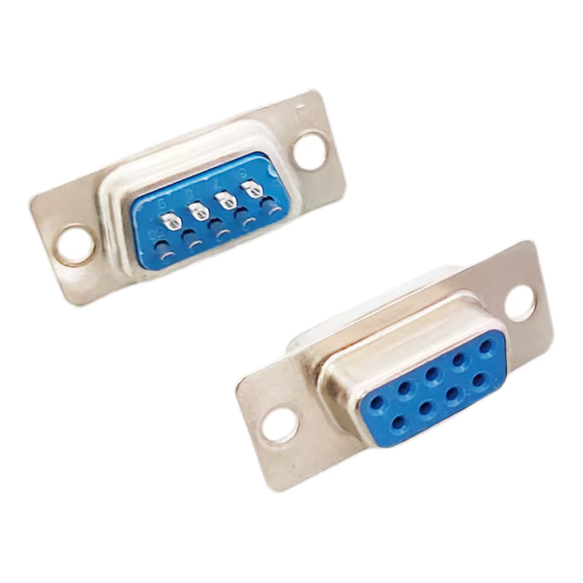
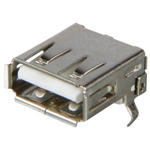
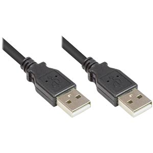

# Hardware

The RetroLink hardware was designed in **Autodesk EAGLE**.

If you want to modify the design yourself, you can download Autodesk EAGLE for free through the **Fusion 360 Personal Use License**. This license is intended for hobbyists and non-commercial projects.

Useful links:

https://www.autodesk.com/products/fusion-360/personal  
https://www.autodesk.com/products/eagle/overview  

The free version has a few limitations, but for small hobby projects like this it works perfectly fine:

- Maximum **2 schematic sheets**
- Maximum **2 signal layers**
- Maximum **100 cm² PCB area**

---

# Ordering the PCB at JLCPCB

If you don't want to build the PCB manually, you can simply order it **fully assembled** from JLCPCB.

To make this easy, the repository already contains the required manufacturing files.

You will find them here:

```
hardware/jlcpcb.com/
```

Inside that folder you will find:

- `CAMOutput.zip` – the Gerber files (PCB manufacturing files)
- `bom.xls` – Bill of Materials
- `cpl.xls` – Component placement file

---

## Step-by-step ordering

1. Go to  
https://jlcpcb.com

2. Log in or create an account.

3. Press **Order Now**

4. Upload the file:

```
CAMOutput.zip
```

5. Choose your preferred **PCB color**

6. Enable **PCB Assembly**

7. Select the quantity  
(usually **2 or 5 boards** is the cheapest option)

8. Press **Next**

9. Press **Next** again

10. Upload the assembly files

- BOM file → `bom.xls`
- CPL file → `cpl.xls`

11. Press **Process BOM & CPL**

12. **Important:** carefully check the detected parts.

13. Press **Next**

14. Check the orientation of the following components:

- **U1** → dot at **bottom-left**
- **U2** → dot at **top-right**
- **U3** → dot at **bottom-right**
- **LED** → **left = negative**, **right = positive**

15. Press **Save to cart**

16. Place your order and complete payment.

17. Now comes the hardest part: **waiting for the package to arrive.**

---

# Adding the DB9 and USB-A connectors

The **DB9** and **USB-A** connectors are **not assembled by JLCPCB**, so you will need to solder them yourself.

Luckily this is very easy and only takes a few minutes.

You will need:

- **DB9 Connector – PCB Mount – Serial – 9 Pin – 2 Rows**
- **USB-A Connector – PCB Mount**

Example connectors:





---

# Flashing the firmware (Windows)

The **CH559L microcontroller** can be programmed directly through USB.

For this you will need a **USB-A to USB-A cable**.



---

## Flashing instructions

1. Clone the complete repository

https://github.com/Fbeen/RetroLink

or use:

```
git clone https://github.com/Fbeen/RetroLink
```

2. Open a **Command Prompt** in Windows.

3. Change to the repository directory

```
cd RetroLink
```

4. Connect the PCB to your computer using the **USB-A to USB-A cable**  
while **holding the button on the PCB**.

5. If everything goes well you should hear the familiar  
**"new USB device detected"** sound from Windows.

6. Run the build script:

```
cd scripts
compile
```

The firmware will now be compiled and flashed to the **CH559L**.

---

# Repository

The complete project can be found here:

https://github.com/Fbeen/RetroLink

Feel free to explore the project, modify the hardware or firmware, and build your own RetroLink adapter.